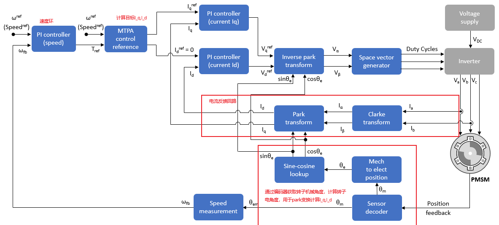

# 无刷电机FOC控制器

***

## 无刷电机数学模型

### 一.永磁同步电机工作原理
 永磁同步电机通过定子绕组通入对称交流电（三相交流电），在电机气隙中产生一个由定子电流和转子永磁体合成产生的两极旋转磁场。当旋转磁场以 $n_s$ 的同步速旋转时，
 由于同性相吸，异性相斥的原理，气隙中的旋转磁场会吸引转子永磁体和它一起旋转。由于转子是由旋转磁场带着旋转的，因此转子的转速和旋转磁场的转速相等。
 由于转子上存在转矩，因此转子和旋转磁场之间会存在一个夹角 $\Delta$ 。当转子上的负载转矩增大时，旋转磁场轴线和转子轴线的夹角 $\Delta$ 就会相应增大；当
 负载转矩减小时，夹角 $\Delta$ 又会减小。通常将 $\Delta$ 称为 $\color{red}{转矩角}$ 或者 $\color{red}{功角}$ 

当负载不超过一定限度时，转子始终跟着旋转磁场的速度n_s旋转，因此转子转速n满足以下公式：
$$ n=n_s=60f/P_n$$
$ P_n为极对数，f为三相定子电源频率$

$ 如果转子上的负载转矩超过一定限度，转子就不会以同步速n_s运行，甚至最后有可能停下来。可以理解为转子上的负载转矩太大导致旋转磁场带不动转子了，这就是$
$ 同步电机失步现象。这个最大限度的转矩称为“最大同步转矩”，因此使用同步电机的时候负载转矩不能超过最大同步转矩。否则就会出现丢步现象，甚至造成电机损坏。$

### 二.永磁同步电机数学模型

$ 以三相电机为例，首先建立定子三相静止坐标系下的模型；然后通过坐标变换对三相电流进行解耦，建立更便于分析处理的转子坐标系d-q坐标系下的数学模型。后续$
$ 我们使用FOC对电机进行控制就是基于d-p坐标系下，对i_q,i_d进行控制从而调节电机的转矩转速的。$

#### 1.定子三相静止坐标系下的模型

$ 三相无刷电机的定子上有A,B,C三相绕组，转子上有永磁体。由于电机输入的是三相正弦交流电，因此电路模型可以使用定子三相静止坐标系的定子电压、电流关系描述。$
$ 首先作以下假设$
$ (1)忽略磁路饱和、磁滞和涡流的影响，认为磁路是线性的，可以应用叠加定律。$
$ (2)定子三相绕组对称。$ 
$ (3)忽略磁场高次谐波，电机感应电势呈正弦波。$
因此可以得到永磁同步电机定子电势平衡方程式和磁链表达式如下:

定子电势平衡方程式：
$$ \left\{\begin{matrix}
  u_A=R_si_A+\frac{d\psi_A}{dt}\\
\\
  u_B=R_si_B+\frac{d\psi_B}{dt}\\
\\
  u_C=R_si_C+\frac{d\psi_C}{dt}\\
\end{matrix}\right.
$$
$ 其中u_A,u_B,u_C为三相绕组电压，i_A,i_B,i_C为三相绕组相电流，\psi_A,\psi_B,\psi_C 是三相绕组磁链，R_s 为绕组相电阻（这里认为三相绕组的项电阻都相等）$

磁链表达式为：
$$ \left\{\begin{matrix}
  \psi_A=L_{AA}i_A+M_{AB}i_B+M_{AC}i_C+\psi_{fA}\\
  \\
  \psi_B=M_{BA}i_A+L_{BB}i_B+M_{BC}i_C+\psi_{fB}\\
  \\
  \psi_C=M_{CA}i_A+M_{CB}i_B+L_{CC}i_C+\psi_{fC}\\
\end{matrix}\right.
$$
$ 其中L_{AA},L_{BB},L_{CC}分别为每项绕组电感；M_{AB}=M_{BA},M_{BC}=M_{CB},M_{AC}=M_{CA}为每两项之间的互感系数，\psi_{fA},\psi_{fB},\psi_{fC}分别为三相 $
$ 绕组匝链的转子永磁磁链（就是转子永磁体通过绕组的磁通）并且满足以下关系：$

$$ \left\{\begin{matrix}
  \psi_{fA}=\psi_f \cos(\theta)\\
\\
  \psi_{fB}=\psi_f \cos(\theta-2pi/3)\\
\\
  \psi_{fC}=\psi_f \cos(\theta+2pi/3)\\
\end{matrix}\right.
$$
$其中\psi_f为定子绕组匝链中最大的转子永磁磁链（就是转子永磁体通过定子绕组的最大磁链）$
$ 当我们把磁链表达式中的关系带入定子电势平衡方程中，可得到以下结果$

$$ \left \{ 
  \begin{matrix}
  u_A=R_si_A+L_{AA}\frac{di_A}{dt}+M_{AB}\frac{di_B}{dt}+M_{BC}\frac{di_c}{dt}+\frac{d\psi_{fA}}{dt}\\
  \\
  u_B=R_si_B+M_{AB}\frac{di_A}{dt}+L_{BB}\frac{di_B}{dt}+M_{BC}\frac{di_C}{dt}+\frac{d\psi_{fB}}{dt}\\
  \\
  u_C=R_Si_C+M_{AC}\frac{di_A}{dt}+M_{BC}\frac{di_B}{dt}+L_{CC}\frac{di_C}{dt}+\frac{d\psi_{fC}}{dt}\\
  \end{matrix}
  \right.
$$
让我们对上述公式进一步理解，首先了解两个概念：
**自感** 是指当电路中的电流变化时，电流本身在电路中产生电动势（称为感应电动势）的现象。自感现象通常发生在具有电感元件的电路中，例如线圈或电感器。其产生的根本原
因可以归结为电磁感应定律，即由法拉第电磁感应定律解释的现象。满足关系：$ \epsilon_1=L\frac{dI}{dt}$,其中$ \epsilon_1$为感应电动势,$ L$为电感 $ I$为通过绕组的相电流

**互感**是指两个或多个彼此靠近的电路或线圈之间，当一个电路中的电流发生变化时，会在另一个电路中产生感应电动势的现象。这与自感不同，互感是由于电流变化引起的磁场穿
过另一个电路或线圈，从而在那个电路中感应出电动势。满足关系：$ \epsilon_2=M\frac{dI}{dt}$,其中$ \epsilon_2$为感应电动势,$ M$为互感系数 $ I$为通过绕组的相电流

以A相为例，其中第一项是相电流通过相电阻产生的压降，第二项是相电流自己产生的自感，三四项是其他两相电流产生的互感，而最后一项则是转子永磁体磁链通过绕组产生的感应电动势。

通过上面的结果我们可以看到式子中相与相之间互相耦合，控制起来非常不方便。同时我们可以知道三相之间的电流其实是三个相位差相差120度的正弦电流，因此我们希望通过坐标变换将
正弦值变换为我们便于分析的值（最好是恒定值）。下面的坐标变换就会实现我们的目的，将三相正弦电流变为静止恒定的电流，实现对三相电流的解耦，从而便于我们后续控制三相电机。

#### 2.坐标变换

坐标变换的实质是通过进行数学上的相似变换，使电机模型中的电感矩阵对角化，最终实现永磁同步电机的解耦或近似解耦

##### 电流关系

对于无刷电机来说，我们通过控制无刷电机A，B，C三相的电流来控制磁场，从而驱动无刷电机。
无刷电机的定子上有三个绕组，它们彼此相隔120°电角度。假设这三相绕组是对称的，分别为A,B,C
，它们所产生的电动势也是对称的，且相位差为120°。因此，每一相电流的表达式可以写成正弦波的形式：

$$i_a=I\sin(\omega_rt)$$

$$i_b=I\sin(\omega_rt-\frac{2\pi}{3})$$

$$i_c=I\sin(\omega_rt+\frac{2\pi}{3})$$

$\omega_r为转子的速度（注意这个速度是电角度的速度）,I为电流幅值$

由基尔霍夫定律有：

$$i_a+i_b+i_c=0$$
因此只需要知道两相的电流就能知道第三相的电流

##### Clark变换

Clark变换用于将三相电流 $I_a,I_b,I_c$ 转换为α-β静止参考系下的两相电流 $i_\alpha,i_\beta:$

$$\left[\begin{matrix}i_\alpha\\
i_\beta\\
\end{matrix}\right]=K\left[\begin{matrix}
    1&-\frac{1}{2}&-\frac{1}{2}\\
    0&\frac{\sqrt{3}}{2}&-\frac{\sqrt{3}}{2}
  \end{matrix}\right] 
  \left[\begin{matrix}
    i_a\\
    i_b\\
    i_c
  \end{matrix}\right]
$$

其中$ K$是变换系数，K在恒功率和恒幅值变换中值不同，这在后续SVPWM中有用

##### Park变换

由于结果$ clark$变换后的电流还是两项的正弦交流电，控制起来还是很麻烦。因此我们通过利用转子的位置角(电角度) $\theta_r，将\alpha-\beta静止坐标系下的两相电流转换为与转子磁场同步旋转坐标系d-p坐标系下的电流i_d,i_q，变换后的i_d,i_q电流在d-p坐标系中是两个恒定值。 $

$$\left[\begin{matrix}i_q\\
i_d\\
\end{matrix}\right]=\left[
    \begin{matrix}
        \cos(\theta_r)&\sin(\theta_r)\\
        -\sin(\theta_r)&\cos(\theta_r)\\
    \end{matrix}\right]\left[
\begin{matrix}i_\alpha\\
    i_\beta
\end{matrix}
\right]
$$
通过$ clark$变换和$ park$变换就可以将三相正弦交流电变换为直流量，从而实现后续foc控制。

##### dq坐标系下数学模型

通过上述一系列变换，我们可以得到dq坐标系下的电势平衡方程：

###### (1)电势平衡方程

$$
\left\{\begin{matrix}
  u_d=R_si_d+\frac{\psi_d}{dt}-\omega_r\psi_q\\
  \\
  u_q=R_si_q+\frac{\psi_q}{dt}+\omega_r\psi_d\\
\end{matrix}\right.
$$
$ u_d,u_q$分别为定子电压在d，q轴分量（单位为V）；$ i_d,i_q$分别为定子电流在d，q轴分量（单位A）；$ \psi_d, \psi_q$ 分别为定子磁链在d，q轴分量（单位Wb）;$ \omega_r$ 转子的电角速度（单位rad/s）

###### (2)磁链表达式

$$
\left\{
  \begin{matrix}
    \psi_d=L_di_d+\psi_f\\
    \\
    \psi_q=L_qi_q\\
  \end{matrix}
\right.
$$
式中，$ L_d,L_q$分别为三相定子绕组在d,q轴上的等效电感（单位为H）;$ \psi_f$为转子永磁体产生的磁链（单位Wb）

###### (3)电磁转矩表达式

$$
T=p_n(\psi_fi_q+(L_d-L_q)i_di_q)
$$
从式子中可以将永磁同步电机的电磁转矩分为两个部分:一个是转子永磁磁场与定子绕组q轴电流作用产生的永磁转矩$ T_m$；另一个是由电感变化引起的磁阻转矩$ T_r$
$$
T_m=p_n\psi_fi_d\\
T_r=p_n(L_d-L_q)i_di_q
$$

当交直轴磁阻不同时，电感$L_d$,$L_q$不相等，因此存在磁阻转矩。实际中因为多使用的是表贴式永磁同步电机，可以认为其转子结构是对称的，则$L_d=L_q=L_s$,因此
$$
T=p_n\psi_fi_q
$$
从这个式子中可以看到转矩中不包含磁阻转矩，电磁转矩仅与定子电流中的交轴分量($ i_q$)有关，因此永磁同步电机的电磁转矩控制最终归结为对直轴(d轴)和交轴（q轴）电流的控制。

###### (4)机械运动方程

$$
T=T_L+B\omega_f+J\frac{d\omega_f}{dt}
$$
式子中$T_L$是负载转矩;$ B$为粘滞摩擦系数；$ \omega_f$为转子机械角速度，$ \omega_f=\frac{\omega_r}{p_n}$;J为电机包括负载折算到电机转子轴上的转动惯量

###### (5)表贴式永磁同步电机状态方程

根据（1）（2）（3）（4）中的电势方程，转矩方程和运动方程可以得到永磁同步电机的数学模型如下：
$$
\left[\begin{matrix}
  \frac{di_d}{dt}\\
  \\
  \frac{di_q}{dt}\\
  \\
  \frac{d\omega_f}{dt}
\end{matrix}
\right]=\left[
  \begin{matrix}
    -\frac{R_s}{L_d}&p_n\omega_f&0\\
    \\
    -p_n\omega_f&-\frac{R_s}{L_q}&-\frac{p_n\psi_f}{L_q}\\
    \\
    0&\frac{p_n\psi_f}{J}&-\frac{B}{J}\\
  \end{matrix}
\right]
\left[\begin{matrix}
  i_d\\
  \\
  i_q\\
  \\
  \omega_f
\end{matrix}\right]
+
\left[\begin{matrix}
  \frac{u_d}{L_d}\\
  \\
  \frac{u_q}{L_q}\\
 \\
  -\frac{T_L}{J}
\end{matrix}\right]
$$
从（5）中可以看出永磁无刷同步电机系统是个多变量非线性的系统。

#### 3.如何实现对转矩和转速的控制

对转矩的控制我们通过前面（3）电磁转矩的公式可以知道，我们是通过控制电流$ i_q$来控制转矩大小的，那么对于转速我们要怎么控制呢？
从上面（5）中，我们已经得到了永磁同步电机的数学模型，我们将数学模型中的第三行拿出来可以得到这样一个微分方程：
$$
\frac{d\omega_f}{dt}=\frac{p_n\psi_f}{J}i_q-\frac{B}{J}\omega_f-\frac{T_L}{J}
$$
对上述微分方程求解可以得到：

$$
\omega_f=-\frac{T_L -{\mathrm{e}}^{-\frac{B\,x}{J}} \,{\left(T_L +P_n \,i_q \,\varphi_f \right)}+P_n \,i_q \,\varphi_f }{B}
$$
从这个式子中我们可以看出，我们只要通过调节电流$ i_q$就可以调节转子的转速了！
为了更好的理解这个调节过程，我们使用matlab绘制不同i_q下不同的转速曲线
假设永磁同步电机各个参数如下：

参数名称   |value|单位
----------|------|-----
$p_n$ | 7 | 对
$\phi_f  $| 0.01 |Wb
$ J$ | 1 |N*m
$ B$ | 3 |
$ T_L$| 3| N

将速度带入上述式子，并让i_q从1到20A进行变化，可以得到以下曲线：


可以看出随着$i_q$的增加，转速$\omega_f$越来越大，负值是因为方向问题。
附matlab代码:
```matlab

syms x y(x) A C D i_q Omega(x) P_n phi_f B J T_L T

P_n=7;
phi_f=0.1
J=1
B=3
T_L=3
i_q=1

A=P_n*phi_f/J*i_q
C=-B/J
D=-T_L/J

% eqn=(B*Omega+J*diff(Omega,x)==T-T_L)
% dsolve(eqn,x)
% eqn=(C*y-diff(y,x)==A-D)%注意原来方程中的"="改成了"=="
% f_1=dsolve(eqn,'y(0)=0','x')
% Omegy=matlabFunction(f_1);
% x=0:0.01:10
% y=Omegy(x)
figure
hold on
xlabel('t')
ylabel('\omega_r')
for i_q=1:1:20
A=P_n*phi_f/J*i_q;
eqn=(C*y-diff(y,x)==A-D);
Omegy=matlabFunction(dsolve(eqn,'y(0)=0','x'));
t=0:0.01:10;
f=Omegy(t);
%绘制标签用
avg = mean(i_q);
txt = ['i_q=' num2str(avg) ' A'];
text(6,f(500),txt)

plot(t,f)
end


```
从上面的例子我们可以很清楚的知道只要控制电流$ i_q$就可以控制转速，但是我们一开始学到的公式是：$n=\frac{60f}{p_n}$,这个式子是通过控制频率来调速的，包括课本
讲的也是通过控制频率调速，那为什么控制$i_q$也能调速呢？
实际上我们控制$i_q$最终是通过控制逆变器输出来调节频率f实现调速的功能，也就是通过调节$i_q$间接调节$f$实现对无刷电机的调速。
我们再使用matlab来更好理解这个控制过程
假设无刷电机参数如下：
名称|值|单位
----|-------|----|
$ i_q$| 10 |A
$ i_d$| 0(一般为0)| A
$ R_s$| 0.22|A
$ L_d$|0.1|H
$ L_q$|0.1|H
$\psi_f$|0.01|Wb
$\omega_f$|5-10|rad/s

当$\omega_f=5$时，三相电流图像如下：


当$\omega_f=10$时，三相电流图像如下：


可以很明显看出，当$\omega_f$变大，三相电流的频率也会增加，这和我们上述公式是符合的。


#### 4.FOC实现
事实上，到这里我们已经可以理解如何控制无刷电机了，FOC其实
 <!-- 此路径表示图片和MD文件，处于同一目录 -->
图片来自matlab官方教程
